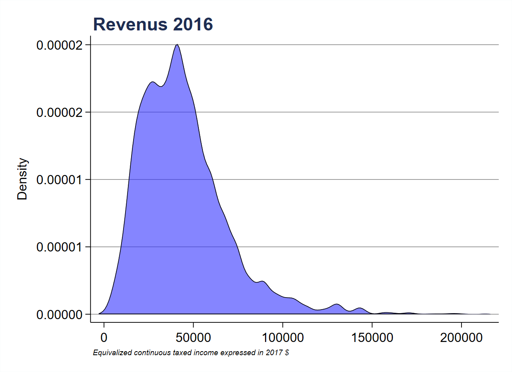
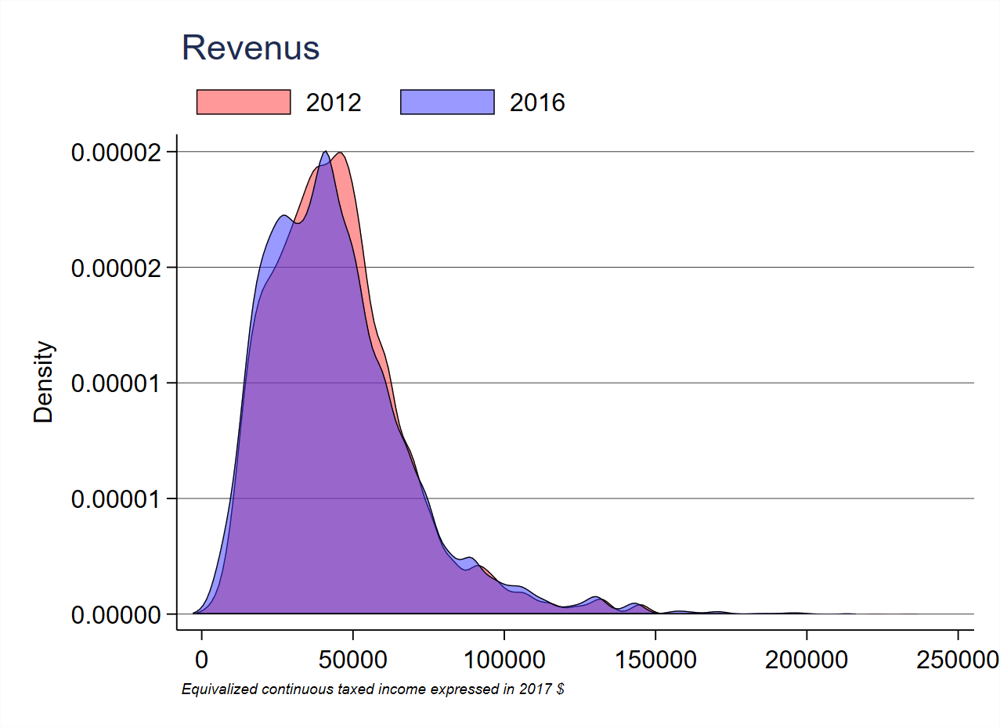

```{r setup, include=FALSE}
knitr::opts_chunk$set(echo = TRUE)
```


* Le TP suit l'ordre des graphiques présentées dans la partie "visualisation des données avec Stata"
* Graphiques utilisés
  * histogramme, densité:`histogram` - `kdensity` / `area` `line`
  * boxplot: `graph box` / `grap hbox`
  * Nuage de points: `scatter`
  * heatmap avec hexagones: `hexplot`
  * Barres pour les variables catégorielles: `catplot` - `spineplot`
* J'ai utilisé trois couleurs simple pour une grande partie du document (red, blue, yellow), `colorpalette` et `grstyle` sont utilisés tardivement
* Les personnes qui n'ont pas, au moins, la version 15 de stata, ne peuvent pas utiliser les effets de transparence: `option_couleur(couleur%#)`

```{r,eval=F, echo=T} 
use base4var, clear
```


# revenus 2012 ou 2016: histogramme - densité 

## Histogramme

Premier graph du program 

<details>
<summary><B><font color="#178ACC">PROGRAMME</B></font></summary>
```{r,eval=F, echo=T} 
histogram r16, normal 
```
</details>


Nombre de barres =  20

<details>
<summary><B><font color="#178ACC">PROGRAMME</B></font></summary>
```{r,eval=F, echo=T} 
histogram r16, bin(20)
```
</details>


Changements couleurs des barres et contour

<details>
<summary><B><font color="#178ACC">PROGRAMME</B></font></summary>
```{r,eval=F, echo=T} 
* barre
histogram r16, bin(20) fc(blue)
```
</details>


<details>
<summary><B><font color="#178ACC">PROGRAMME</B></font></summary>
```{r,eval=F, echo=T} 
* barre et contour même couleur
histogram r16, bin(20) color(blue)
```
</details>


<details>
<summary><B><font color="#178ACC">PROGRAMME</B></font></summary>
```{r,eval=F, echo=T} 
* barre et contour couleurs différentes
histogram r16, bin(20) color(blue)
```
</details>


Modification de la transparence (stata 15 minimum) ou de la saturation (intensity)

<details>
<summary><B><font color="#178ACC">PROGRAMME</B></font></summary>
```{r,eval=F, echo=T} 
* 60% transparence
histogram r16, bin(20) fc(blue%60) lc(white)
```
</details>


<details>
<summary><B><font color="#178ACC">PROGRAMME</B></font></summary>
```{r,eval=F, echo=T} 
* .6 saturation
histogram r16, bin(20) fc(blue*.6) lc(white)
```
</details>


En ajoutant quelques options:  

* Report des %
* valeur de y en horizontal
* modification du grid y (couleur et épaisseur)
* note pour la définition du revenu et non le titre de x - en italique
* titre positionné à 11 heures, en gras

<details>
<summary><B><font color="#178ACC">PROGRAMME</B></font></summary>
```{r,eval=F, echo=T} 
tw histogram r16, percent fc(blue%60) lc(black) lw(vthin) bin(20) ///
title("{bf:Revenus 2016}", pos(11)) ///
ylabel(, angle(0) glc(gs3) glw(.1)) ///
xtitle("") ///
note("{it:Equivalized continuous taxed income expressed in 2017 $}", size(2)) ///
graphr(color(white)) plotr(color(white))
```
</details>


## Densité

Directement avec `kdensity`

<details>
<summary><B><font color="#178ACC">PROGRAMME</B></font></summary>
```{r,eval=F, echo=T} 
kdensity r16
```
</details>


<details>
<summary><B><font color="#178ACC">PROGRAMME</B></font></summary>
```{r,eval=F, echo=T} 
kdensity r16, n(200) kernel(gauss)
```
</details>


Avec kdensity (création variable) + area/line 

Création des variables

<details>
<summary><B><font color="#178ACC">PROGRAMME</B></font></summary>
```{r,eval=F, echo=T} 
kdensity r16, gen(x d) n(200) kernel(gauss) nograph
```
</details>

Graphique

<details>
<summary><B><font color="#178ACC">PROGRAMME</B></font></summary>
```{r,eval=F, echo=T} 
tw line  d x, recast(area)  color(blue%60)
```
</details>

ou 

<details>
<summary><B><font color="#178ACC">PROGRAMME</B></font></summary>
```{r,eval=F, echo=T} 
tw area  d x, color(blue%60)
```
</details>


En ajoutant quelques options:  

* valeur de y en horizontal et changement du format
* modification du grid y (couleur et épaisseur)
* note pour la définition du revenu et non le titre de x - en italique
* titre positionné à 11 heures, en gras

<details>
<summary><B><font color="#178ACC">PROGRAMME</B></font></summary>
```{r,eval=F, echo=T} 
tw area  d x,  fc(blue%60) lc(black) lw(.5pt)                                 ///
ytitle("Density") xtitle("")                                                  ///
title("{bf:Revenus 2016}", pos(11))                                           ///
ylabel(, angle(0) glc(gs3) glw(.1) format(%9.5f))                             ///
note("{it:Equivalized continuous taxed income expressed in 2017 $}", size(2)) ///
graphr(color(white)) plotr(color(white))
```
</details>




**Revenus 2012 et 2016**  

Superposition [avec macros]

<details>
<summary><B><font color="#178ACC">PROGRAMME</B></font></summary>
```{r,eval=F, echo=T} 
capt drop  _d* _x*
local c1 "red%50"
local c2 "blue%50"
local i=1
foreach v of varlist r12 r16 {
local j = `i++'
local y: subinstr local v "r" ""
kdensity `v', gen(_x`v' _d`v') n(200) kernel(gauss) nograph
local area `area' area _d`v' _x`v', fc(`c`j'') lc(black) lw(vthin) ||
local ord `ord' `j' "20`y'"
}
tw `area', legend(order(`ord') pos(1) region(lc(%0)))                                   ///
ytitle("Density")                                                                       ///
title("Revenus", pos(11)) xtitle("")                                                    ///
ylabel(, angle(0) glc(gs3) glw(.1) labs(2) format(%9.5f))                               ///
note("{it:Equivalized continuous taxed income expressed in 2017 $}", size(2))           ///
graphr(color(white)) plotr(color(white))
```
</details>




Type beans [sans macro]

<details>
<summary><B><font color="#178ACC">PROGRAMME</B></font></summary>
```{r,eval=F, echo=T} 
gen _dr16b = -_dr16

tw  area _dr12 _xr12,   fc(red%60)  lc(%0)                                     ///
||  line _dr12 _xr12,   lc(red)     lw(.1)                                     ///
||  area _dr16b _xr16,  fc(blue%60) lc(%0)                                     /// 
||  line _dr16b _xr16,  lc(blue)    lw(.1)                                     ///   
legend(order(1 "2012" 3 "2016") pos(1) region(lc(%0)))                         ///
ytitle("Density")                                                              ///
title("Revenus", pos(11)) xtitle("")                                           ///
ylabel(, labc(%0) glc(%0) tlc(%0))                                             ///
note("{it:Equivalized continuous taxed income expressed in 2017 $}", size(2))  ///
graphr(color(white)) plotr(color(white))
```
</details>


# Revenus et statut matrimonial: histogrammes - densité - box

## histogrammes 

Superposition: peu lisible

<details>
<summary><B><font color="#178ACC">PROGRAMME</B></font></summary>
```{r,eval=F, echo=T} 
local leg 1 "Married or pacsed" 2 "Cohabitant" 3 "Isolated"

tw histogram r16 if ms16==3, bin(20) percent fc(yellow%50) lc(black) lw(vvvthin) start(0)  ///
|| histogram r16 if ms16==2, bin(20) percent fc(blue%50) lc(black)   lw(vvvthin) start(0)  ///
|| histogram r16 if ms16==1, bin(20) percent fc(red%50)  lc(black)   lw(vvvthin) start(0)  ///
|| , legend(order(`leg'))  
```
</details>


Facettes avec en arrière plan les distributions des autres modalités

<details>
<summary><B><font color="#178ACC">PROGRAMME</B></font></summary>
```{r,eval=F, echo=T} 
local bgc plotr(color(white)) graphr(color(white))
local note note("{it:Equivalized continuous taxed income expressed in 2017 $}", size(2)) 

tw histogram r16 if ms16==1, bin(20) percent fc(red%20)    lc(%0)    lw(vvthin) start(0) ///
|| histogram r16 if ms16==2, bin(20) percent fc(blue%20)   lc(%0)    lw(vvthin) start(0) ///
|| histogram r16 if ms16==3, bin(20) percent fc(yellow%70) lc(black) lw(vvthin) start(0) ///
||, legend(off)  title("Isolated", pos(11)) xtitle("") `bgc' `note'  name(g1, replace)

tw histogram r16 if ms16==3, bin(20) percent fc(yellow%20) lc(%0)    lw(vvthin) start(0) ///
|| histogram r16 if ms16==1, bin(20) percent fc(red%20)    lc(%0)    lw(vvthin) start(0) ///
|| histogram r16 if ms16==2, bin(20) percent fc(blue%70)   lc(black) lw(vvthin) start(0) ///
||, legend(off)  title("Cohabitant", pos(11)) xtitle("") `bgc' `note'  name(g2, replace)

tw histogram r16 if ms16==3, bin(20) percent fc(yellow%20) lc(%0)    lw(vvthin) start(0) ///
|| histogram r16 if ms16==2, bin(20) percent fc(blue%20)   lc(%0)    lw(vvthin) start(0) ///
|| histogram r16 if ms16==1, bin(20) percent fc(red%70)    lc(black) lw(vvthin) start(0) ///
||, legend(off)  title("Married or pacsed couple", pos(11)) xtitle("") `bgc' `note'  name(g3, replace)

graph combine g1 g2 g3 , xsize(20) ysize(7) col(3) ///
note("Equivalized continuous taxed income expressed in 207 $") ///
title("Revenus 2016", pos(11))  plotr(color(white)) graphr(color(white))
```
</details>


## Densités

Création des variables avec `kdensity`

<details>
<summary><B><font color="#178ACC">PROGRAMME</B></font></summary>
```{r,eval=F, echo=T} 
kdensity r16 if ms16==1, kernel(gauss) n(300)  gen(x1 d1) nograph
kdensity r16 if ms16==2, kernel(gauss) n(300)  gen(x2 d2) nograph
kdensity r16 if ms16==3, kernel(gauss) n(300)  gen(x3 d3) nograph
```
</details>

Plus lisible qu'un histogramme à mon avis

<details>
<summary><B><font color="#178ACC">PROGRAMME</B></font></summary>
```{r,eval=F, echo=T} 
local leg legend(order(3 "Married or pacsed" 2 "Cohabitant" 1 "Isolated") pos(7) col(3) region(lc(%0))) 
local bgc plotr(color(white)) graphr(color(white))
local note note("{it:Equivalized continuous taxed income expressed in 2017 $}", size(2)) 
local title title("{bf:Revenus 2016}", pos(11)) xtitle("") 
tw area d3 x3, fc(yellow%50) lc(black) lw(vthin) ///
|| area d2 x2, fc(blue%50)   lc(black) lw(vthin) ///
|| area d1 x1, fc(red%50)    lc(black) lw(vthin) ///
|| , ytitle("") `leg'  `bgc'  `note'  `title'
```
</details>


<details>
<summary><B><font color="#178ACC">PROGRAMME</B></font></summary>
```{r,eval=F, echo=T} 
local bgc plotr(color(white)) graphr(color(white))
local note note("{it:Equivalized continuous taxed income expressed in 2017 $}", size(2)) 

tw area d1 x1, fc(red%20)    lc(%0)                         ///
|| area d2 x2, fc(blue%20)   lc(%0)                         ///
|| area d3 x3, fc(yellow%80) lc(black)  lw(vthin)           ///
||, legend(off)  title("Isolated", pos(11))                 ///
 xtitle("") ytitle("Density") `bgc' `note' name(g1, replace)

tw area d3 x3, fc(yellow%20) lc(%0)                         ///
|| area d2 x2, fc(red%20)    lc(%0)                         ///
|| area d1 x1, fc(blue%80)   lc(black)  lw(vthin)           ///
||, legend(off)  title("Cohabitant", pos(11))               ///
    ylabel(, labc(%0))                                      ///
    xtitle("") ytitle("") `bgc' `note' name(g2, replace)

tw area d3 x3, fc(yellow%20) lc(%0)                         ///
|| area d1 x1, fc(blue%20)   lc(%0)                         ///
|| area d2 x2, fc(red%80)    lc(black)  lw(vthin)           ///
||, legend(off)  title("Married or pacsed couple", pos(11)) ///
    ylabel(,labc(%0))                                       ///
    xtitle("") ytitle("") `bgc' `note' name(g3, replace)

graph combine g1 g2 g3 , xsize(20) ysize(7) col(3) ///
note("Equivalized continuous taxed income expressed in 2017 $") ///
title("Revenus 2016", pos(11))  plotr(color(white)) graphr(color(white))
```
</details>


## Box

<details>
<summary><B><font color="#178ACC">PROGRAMME</B></font></summary>
```{r,eval=F, echo=T}
graph box r16, over(ms16, descending) 
```
</details>


<details>
<summary><B><font color="#178ACC">PROGRAMME</B></font></summary>
```{r,eval=F, echo=T}
graph box r16, over(ms16, descending) horizontal 
```
</details>


Ajouts d'options pour couleurs différentes (pas obligatoire cas variable statut mat sans dimension ordinale)

<details>
<summary><B><font color="#178ACC">PROGRAMME</B></font></summary>
```{r,eval=F, echo=T}
local bgc plotr(color(white)) graphr(color(white))
local note note("{it:Equivalized continuous taxed income expressed in 2017 $}", size(2)) 
local title title("{bf:Revenus 2016}", pos(11))   
local mops msiz(vsmall) mlc(black) mlw(vthin)

graph hbox r16, over(ms16) asyvar                                       ///
bar(1, fc(red)    lc(black) lw(thin))  m(1, mc(red%40)    `mops')       ///
bar(2, fc(blue)   lc(black) lw(thin))  m(2, mc(blue%40)   `mops')       ///
bar(3, fc(yellow) lc(black) lw(thin))  m(3, mc(yellow%40) `mops')       ///
legend(pos(11) row(1) stack region(lw(0)) size(small) symysize(vsmall)) ///
ytitle("") `bgc' `note' `title' 
```
</details>


# 2d: scatter - hexplot

Revenus 2012 et 2016

## Scatter

<details>
<summary><B><font color="#178ACC">PROGRAMME</B></font></summary>
```{r,eval=F, echo=T}
tw scatter r16 r12, mc(red)
```
</details>


<details>
<summary><B><font color="#178ACC">PROGRAMME</B></font></summary>
```{r,eval=F, echo=T}
tw scatter r16 r12,  mc(red) mlc(white)
```
</details>


<details>
<summary><B><font color="#178ACC">PROGRAMME</B></font></summary>
```{r,eval=F, echo=T}
tw scatter r16 r12, msiz(.3) mc(red) mlc(white) mlw(.05)
```
</details>


<details>
<summary><B><font color="#178ACC">PROGRAMME</B></font></summary>
```{r,eval=F, echo=T}
tw scatter r16 r12, msiz(.3) mc(red%50) mlc(white) mlw(.05) jitter(2)
```
</details>


** Par statut matrimonial

*Avec transparence*

<details>
<summary><B><font color="#178ACC">PROGRAMME</B></font></summary>
```{r,eval=F, echo=T}
local leg legend(order(3 "Married or pacsed" 2 "Cohabitant" 1 "Isolated") pos(11) col(3) region(lc(%0))) 
local bg plotr(color(white)) graphr(color(white))
local note note("{it:Equivalized continuous taxed income expressed in 2017 $}", size(2)) 
local title title("{bf:Revenus 2016}", pos(11)) xtitle("") 
local mops  msiz(1) mlc(black) mlw(.05) jitter(2)

tw scatter r16 r12 if ms16==1, mc(red%60)    `mops'     ///
|| scatter r16 r12 if ms16==3, mc(yellow%60)  `mops'    ///
|| scatter r16 r12 if ms16==2, mc(blue%60)    `mops'    ///
|| , xtitle("2012") ytitle("2016")  `note' `title' `bg' ///
`leg' `title' `note' `bg'
```
</details>


*Avec diminution de la saturation*

Même programme, juste modifier les couleurs des bulles : par ex **`mc(red%60)`** par   **`mc(red*.6)`**


Version avec un fond sombre (couleur gs3), et en utilisant `grstyle`
<details>
<summary><B><font color="#178ACC">PROGRAMME</B></font></summary>
```{r,eval=F, echo=T}
graph set window fontface "Microsoft sans serif"

grstyle  init
grstyle set mesh, compact 
grstyle set legend 11, nobox

local mops  msiz(1) mlc(black) mlw(.05) jitter(2)
local bg  graphr(color(gs3)) plotr(color(gs3))
local xy glc(gs13) glw(vthin) labc(gs13)
local leg legend(order(1 "Married or pacsed" 2 "Cohabitant" 3 "Isolated") ///
      row(1) color(gs13))
local title title("{bf: Revenus 2016}", pos(11) color(gs13)) 	  

tw scatter r16 r12 if ms16==1, mc(red*.60)     `mops'          ///
|| scatter r16 r12 if ms16==3, mc(yellow*.60)  `mops'          ///
|| scatter r16 r12 if ms16==2, mc(blue*.60)    `mops'          ///
|| , xtitle("2012", color(gs13)) ytitle("2016", color(gs13))   ///
     `title' `leg'  `bg' xlabel(, `xy')
```
</details>


** Facettes**

Le programme suivant peut être automatisé dans une boucle


<details>
<summary><B><font color="#178ACC">PROGRAMME</B></font></summary>
```{r,eval=F, echo=T}
local mops  msiz(.7) mlc(gs3) mlw(.1) jitter(2) 
local bg  graphr(color(gs3)) plotr(color(gs3))   
local xy glc(gs13) glw(vthin) labc(gs13)         
    
tw scatter r16 r12 if ms16!=1, mc(gs13%20)     `mops'            ///
|| scatter r16 r12 if ms16==1, mc(red%70)     `mops'             ///
|| , xtitle("2012", color(gs13)) ytitle("2016", color(gs13))     ///
     `leg'  `bg' xlabel(, `xy') legend(off)  ///
	title("Married or pacsed", pos(11) color(red*.6)) name(g1,replace)

tw scatter r16 r12 if ms16!=2, mc(gs13%20)     `mops'            ///
|| scatter r16 r12 if ms16==2, mc(blue%70)        `mops'         ///
|| , xtitle("2012", color(gs13)) ytitle("2016", color(gs13))     ///
     `leg'  `bg' xlabel(, `xy') legend(off)  ///
	title("Cohabitant", pos(11) color(blue*.6))	  name(g2,replace)
	
tw scatter r16 r12 if ms16!=3, mc(gs13%20)     `mops'              ///
|| scatter r16 r12 if ms16==3, mc(yellow%70)        `mops'         ///
|| , xtitle("2012", color(gs13)) ytitle("2016", color(gs13))       ///
     `leg'  `bg' xlabel(, `xy') legend(off)  ///
	title("Isolated", pos(11) color(yellow*.6))	  name(g3,replace)
	
graph combine g1 g2 g3, col(3) xsize(20) ysize(10)                ///
graphr(color(gs3)) plotr(color(gs3))                              ///
title("{bf: Revenus 2012 & 2016}", pos(11) color(gs13))           ///
note("{it:Equivalized continuous taxed income expressed in 2017 $}", size(2) color(gs13)) 		 
```	
</details>


Même graphique, mais avec des couleurs différentes (collection colorbrewer) issues de palettes séquentielles (transition pour le graphique suivant qui nécessite ce type de palettes)

<details>
<summary><B><font color="#178ACC">PROGRAMME</B></font></summary>
```{r,eval=F, echo=T}
local s 5

colorpalette matplotlib, spring select(`s') opacity(60) nograph
local col1 `r(p1)'
colorpalette matplotlib, spring select(`s') nograph
local tcol1 `r(p1)'
colorpalette matplotlib, autumn select(`s') opacity(60) nograph
local col2 `r(p1)'
colorpalette matplotlib, autumn select(`s') nograph
local tcol2 `r(p1)'
colorpalette matplotlib, winter select(15) opacity(60) nograph
local col3 `r(p1)'
colorpalette matplotlib, winter select(15) nograph
local tcol3 `r(p1)'

local mops  msiz(.7) mlc(gs3) mlw(.1) jitter(2) 
local bg  graphr(color(gs3)) plotr(color(gs3))   
local xy glc(gs13) glw(vthin) labc(gs13)         
    
tw scatter r16 r12 if ms16==!1, mc(gs13%20)     `mops'          ///
|| scatter r16 r12 if ms16==1, mc("`col1'")    `mops'           ///
|| , xtitle("2012", color(gs13)) ytitle("2016", color(gs13))    ///
     `leg'  `bg' xlabel(, `xy') legend(off)                     ///
	title("Married or pacsed", pos(11) color("`tcol1'")) name(g1,replace)

tw scatter r16 r12 if ms16!=2, mc(gs13%20)     `mops'         ///
|| scatter r16 r12 if ms16==2, mc("`col2'")    `mops'         ///
|| , xtitle("2012", color(gs13)) ytitle("2016", color(gs13))  ///
     `leg'  `bg' xlabel(, `xy') legend(off)                   ///
	title("Cohabitant", pos(11) color("`tcol2'"))	  name(g2,replace)
	
tw scatter r16 r12 if ms16!=3, mc(gs13%20)         `mops'     ///
|| scatter r16 r12 if ms16==3, mc("`col3'")        `mops'     ///
|| , xtitle("2012", color(gs13)) ytitle("2016", color(gs13))  ///
     `leg'  `bg' xlabel(, `xy') legend(off)                   ///
	title("Isolated", pos(11) color("`tcol3'"))	  name(g3,replace)
	
	
graph combine g1 g2 g3, col(3) xsize(20) ysize(10)      ///
graphr(color(gs3)) plotr(color(gs3))                    ///
title("{bf: Revenus 2012 & 2016}", pos(11) color(gs13)) ///
note("{it:Equivalized continuous taxed income expressed in 2017 $}", size(2) color(gs13)) 		 
```	
</details>


## Hexplot

Rappel principe: histogramme vu du dessus, la couleur de l'héxagone indique la hauteur des barres

<details>
<summary><B><font color="#178ACC">PROGRAMME</B></font></summary>
```{r,eval=F, echo=T}
local var3 ms16
local labn: value label  `var3'
local pal spring autumn winter
local i=1

foreach pal2 of local pal {
   local j=`i++'
  
 local title`j': label `labn' `j'
  
colorpalette matplotlib, `pal2' select(1) intensity(2.9) nograph
   local bc `""`r(p1)'""'
   colorpalette matplotlib, `pal2' select(15) nograph
   local tc `""`r(p1)'""'
  hexplot r16 r12 if `var3'==`j', color(matplotlib, `pal2') plotr(color(`bc')) p(lw(vvthin) lc(`bc')) graphr(color(`bc'))                                                                    ///
ytitle("") xtitle("") xlabel(,glw(.1)) ylabel(,glw(.1))             ///
title("`title`j''", color(`tc)') pos(11))                           ///
legend(color(`tc') subtitle(,color(`tc')) region(color(`bc'))) name(g`j', replace)
 }

graph combine g1 g2 g3, col(3) xsize(20) ysize(6) xcommon ycommon                        ///
title("{bf: Revenus 2012 & 2016}", pos(11) color(gs8))                                   ///
note("{it:Equivalized continuous taxed income expressed in 2017 $}", size(3) color(gs8)) ///
graphr(color(255 164 91%30))	 
```
</details>


# Catplot - spineplot

```{r,eval=F, echo=T}
ssc install catplot
ssc install spineplot
```


* Commande de NJ Cox: trop de paramètres par défaut entrée dans sa commande, plusieurs options visent à les retirer

Revenu 2016: appartenance aux décile selon le statut matrimonial. 

<details>
<summary><B><font color="#178ACC">PROGRAMME</B></font></summary>
```{r,eval=F, echo=T}
xtile dr16 = r16, nq(10)
```
</details>

## Barres

* Pour obtenir des barres empilées, ajouter l'option* **`stack`**

<details>
<summary><B><font color="#178ACC">PROGRAMME</B></font></summary>
```{r,eval=F, echo=T}
grstyle init
grstyle set mesh, compact
grstyle set legend 3, nobox
*grstyle set color viridis,  n(10)

colorpalette viridis, select(2 7 12) nograph
grstyle set color "`r(p1)'" "`r(p2)'" "`r(p3)'",  n(10)

catplot dr16, /*stack*/ percent(ms16) over(ms16) asyvar ///
legend( pos(3) col(1) title("Déciles", size(small)))  ///
l1title("") title("{bf:Revenus 2016}", pos(11)) ///
note("{it:Equivalized continuous taxed income expressed in 2017 $}", size(2)) 
```
</details>

 


## Merimekko (mosaic plot)


<details>
<summary><B><font color="#178ACC">PROGRAMME</B></font></summary>
```{r,eval=F, echo=T}
colorpalette viridis, select(2 8 13) reverse nograph
grstyle set color "`r(p1)'" "`r(p2)'" "`r(p3)'",  n(10)
spineplot  dr16 ms16,                        ///
barall(fi(inten100) blw(vvthin))             ///
legend(title("Déciles", size(small)))        ///
xlabel(0 .81 .86 1 , glw(0) axis(1))         ///
xlabel(, glw(0) alt axis(2))                 ///
ylabel(0(.1)1, axis(2))                      ///
xtitle("", axis(2))                          ///
ytitle("Percent", axis(2))                   ///
xtitle("Percent", axis(1))                   ///
title("{bf: Revenus 2016}", pos(11))    
```
</details>


# EXERCICE

Pour la demi-journée supplémentaire, si vous avez le temps, reproduire le graphique de la slide 19  
Les différentes slides indiquent les différentes étapes

<iframe width="1000" height="800" src="exercice.html"></iframe>


